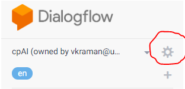
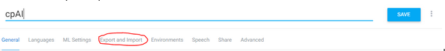

# CPai Setup Guide

CPai is composed of 4 parts:

1. Dialogflow service provided by Google
2. Backend written in Python/Flask
3. Client written in Javascript(Node) - this is another backend that hosts Google Client for interacting with Dialogflow
4. Frontend written in Javascript(Vue)

## Import CPai Dialogflow engine


Open the existing agent you would like to export from/import into in DialogFlow
On the left-hand list, go to the top and click on the settings icon next to your agent name




Click on the Export/Import tab



If exporting, “Export as zip”, if importing, “Import from zip” and choose `cpai_dialogflow_engine.zip`.

The backend and client can be hosted on any NIX server as long as their dependencies can be installed.
However, in this guide, we will use AWS EC2 instances (Ubuntu).

## Client Setup Guide


1. Launch a new EC2 instance by choosing Ubuntu Server 18.04 LTS (HVM), SSD Volume Type - ami-0fc20dd1da406780b (64-bit x86).

-   Configure your security group so that SSH, HTTP (PORT 80) is allowed.

2. SSH into the newly launched EC2 instance and update the system:

```sh
> sudo apt update; sudo apt -y upgrade;
```

3. Install Node.js (this setup installed v13.13.0, the latest version)

```sh
curl -sL https://deb.nodesource.com/setup_13.x | sudo -E bash -
sudo apt-get install -y nodejs
```

3. Install "yarn" (this setup installed v1.22) and restart the terminal.

```sh
curl -o- -L https://yarnpkg.com/install.sh | bash
```

4. Run the following inside `client` folder

```sh
yarn install
```

5. Export your Google Client Credentials/Secret:
   Please follow and obtain your credentials here: https://cloud.google.com/dialogflow/docs/quick/setup#nodejs

```
export GOOGLE_APPLICATION_CREDENTIALS="cpAI-24a315a29ddb.json"
export CPAI_CLIENT_SECRET="rZBCihS0FEG84jnHGh8XD9Z5lGWg0GQe"
```

6. Export the name of your Dialogflow project:

```
export GCP_PROJECT_ID=<your project id>
```

Finally to run:

```
yarn start
```

## Backend Setup Guide


We tested the backend with both python3.7 and python3.6. For this setup, use the default Python3.6 that ships with Ubuntu18.04.

1. Launch a new EC2 instance by choosing Ubuntu Server 18.04 LTS (HVM), SSD Volume Type - ami-0fc20dd1da406780b (64-bit x86).

-   Configure your security group so that SSH, HTTP (PORT 80) and HTTPS (PORT 443) are allowed.

2. SSH into the newly launched EC2 instance and update the system:

```sh
> sudo apt update; sudo apt -y upgrade;
```

3. Copy `backend` folder into the EC2 instance (rsync or git clone) and run the following commands inside the directory (enter yes to all prompts):

-`poppler-utils` is required for a Python module used for converting PDFs to JPEGs.

```sh
sudo apt install -y gcc
sudo apt install -y python3-pip
sudo apt install -y poppler-utils
pip3 install --upgrade pip
pip3 install wheel
pip3 install -r requirements.txt
export FLASK_APP=app.py
export FLASK_ENV=production
```

4. Run the backend:

```sh
sudo python3 -m flask run --host=0.0.0.0 --port=<target port> > ~/log &
```

Google Dialogflow requires that the backend uses HTTP over TLS. You can either configure your EC2 instance to forward all HTTP requests to HTTPS after running the backend app on port 80 or directly run the python app on port 443. As a work around, you may also run `ngrok` which can forward all external traffic to our EC2 instance over HTTP/TLS.


## Client Setup Guide
---
## How to run frontend

### Install "yarn"

```sh
curl -o- -L https://yarnpkg.com/install.sh | bash
````

### 1. Run the client

```sh
cd client
yarn install
```

Then run the following (copy/paste them into your terminal)

```
export GOOGLE_APPLICATION_CREDENTIALS="cpAI-24a315a29ddb.json"
export CPAI_CLIENT_SECRET="rZBCihS0FEG84jnHGh8XD9Z5lGWg0GQe"
```

Finally to run:

```
yarn start
```

### 2. run the actual frontend (on another terminal window)

```
yarn install
yarn serve
```

Then go to http://localhost:8080/
(use chrome)
