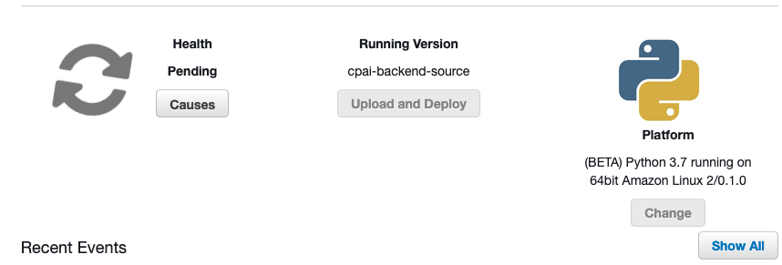

# Backend

---

## To install:

```sh
> source setup.sh
```

### Just remove `env` folder to reset your python environment.

```sh
> rm -rf env
> source setup.sh
```

## Deployment

---

**The best way to deploy a Flask app is using Elastic Beanstalk CLI**

However, as a temporary solution, you can simply zip the code + config files and upload the zip file directly to AWS.

### Prepare a zip to upload to Elastic Beanstalk

```sh
> ./zip.sh
```

Simply upload `app.zip` by clicking on `upload and deploy` -
</img>
