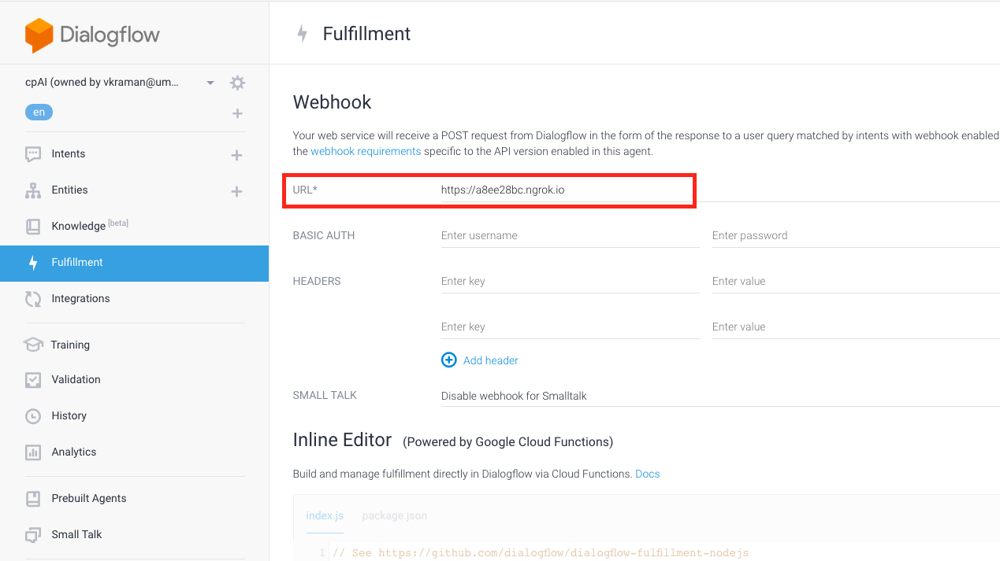

# CPai Setup Guide

CPai is composed of 4 parts:

1. Dialogflow service provided by Google
2. Backend written in Python/Flask
3. Client written in Javascript(Node) - this is another backend that hosts Google Client for interacting with Dialogflow
4. Frontend written in Javascript(Vue)

## Import CPai Dialogflow engine

1. Open the existing agent you would like to export from/import into in DialogFlow
   On the left-hand list, go to the top and click on the settings icon next to your agent name

2. Click on the Export/Import tab

If exporting, “Export as zip”, if importing, “Import from zip” and choose `cpai_dialogflow_engine.zip`.

3. After setting up the _backend_, also make sure the url of the backend is updated in the Dialogflow console.

